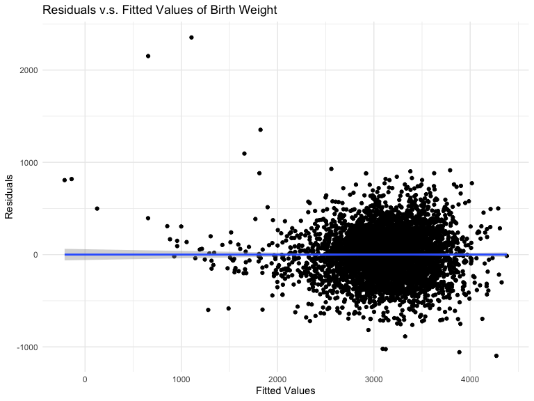

P8105 HW6
================
Shihui Zhu sz3029

## Problem 1

### Import data

Load and clean the data for regression analysis

``` r
birthweight_df <- 
  read_csv("data/birthweight.csv") %>%
  drop_na() %>%
  mutate(
    # change the numbers to text for a better readability
    babysex = ifelse(babysex == 1, 'male', 'female'),
    # convert to factor
    babysex = fct_infreq(babysex),
    # change the numbers to text for a better readability
    frace = case_when(
      frace == 1 ~ 'white',
      frace == 2 ~ 'black',
      frace == 3 ~ 'asian',
      frace == 4 ~ 'puerto_rican',
      frace == 8 ~ 'other',
      frace == 9 ~ 'unknown'),
    # convert to factor
    frace = fct_infreq(frace),
    # change the numbers to text for a better readability
    malform = ifelse(malform == 1, 'present', 'absent'),
    # convert to factor
    malform = fct_infreq(malform),
    # change the numbers to text for a better readability
    mrace = case_when(
      mrace == 1 ~ 'white',
      mrace == 2 ~ 'black',
      mrace == 3 ~ 'asian',
      mrace == 4 ~ 'puerto_rican',
      mrace == 8 ~ 'other'),
    # convert to factor
    mrace = fct_infreq(mrace),
    )

birthweight_df
```

    ## # A tibble: 4,342 × 20
    ##    babysex bhead blength   bwt delwt fincome frace gaweeks malform menarche
    ##    <fct>   <dbl>   <dbl> <dbl> <dbl>   <dbl> <fct>   <dbl> <fct>      <dbl>
    ##  1 female     34      51  3629   177      35 white    39.9 absent        13
    ##  2 male       34      48  3062   156      65 black    25.9 absent        14
    ##  3 female     36      50  3345   148      85 white    39.9 absent        12
    ##  4 male       34      52  3062   157      55 white    40   absent        14
    ##  5 female     34      52  3374   156       5 white    41.6 absent        13
    ##  6 male       33      52  3374   129      55 white    40.7 absent        12
    ##  7 female     33      46  2523   126      96 black    40.3 absent        14
    ##  8 female     33      49  2778   140       5 white    37.4 absent        12
    ##  9 male       36      52  3515   146      85 white    40.3 absent        11
    ## 10 male       33      50  3459   169      75 black    40.7 absent        12
    ## # … with 4,332 more rows, and 10 more variables: mheight <dbl>, momage <dbl>,
    ## #   mrace <fct>, parity <dbl>, pnumlbw <dbl>, pnumsga <dbl>, ppbmi <dbl>,
    ## #   ppwt <dbl>, smoken <dbl>, wtgain <dbl>

### Build model

They are 19 variables in total. We want to select the most important
variables that affect baby’s birth weight to build the regression model.
We will use a data-driven model building process, backwards elimination.

1.  Select variables using backwards elimination, using AIC criteria

``` r
mult.fit = lm(bwt ~ ., data = birthweight_df)
model.best = step(mult.fit, direction = 'backward')
```

    ## Start:  AIC=48717.83
    ## bwt ~ babysex + bhead + blength + delwt + fincome + frace + gaweeks + 
    ##     malform + menarche + mheight + momage + mrace + parity + 
    ##     pnumlbw + pnumsga + ppbmi + ppwt + smoken + wtgain
    ## 
    ## 
    ## Step:  AIC=48717.83
    ## bwt ~ babysex + bhead + blength + delwt + fincome + frace + gaweeks + 
    ##     malform + menarche + mheight + momage + mrace + parity + 
    ##     pnumlbw + pnumsga + ppbmi + ppwt + smoken
    ## 
    ## 
    ## Step:  AIC=48717.83
    ## bwt ~ babysex + bhead + blength + delwt + fincome + frace + gaweeks + 
    ##     malform + menarche + mheight + momage + mrace + parity + 
    ##     pnumlbw + ppbmi + ppwt + smoken
    ## 
    ## 
    ## Step:  AIC=48717.83
    ## bwt ~ babysex + bhead + blength + delwt + fincome + frace + gaweeks + 
    ##     malform + menarche + mheight + momage + mrace + parity + 
    ##     ppbmi + ppwt + smoken
    ## 
    ##            Df Sum of Sq       RSS   AIC
    ## - frace     4    124365 320848704 48712
    ## - malform   1      1419 320725757 48716
    ## - ppbmi     1      6346 320730684 48716
    ## - momage    1     28661 320752999 48716
    ## - mheight   1     66886 320791224 48717
    ## - menarche  1    111679 320836018 48717
    ## - ppwt      1    131132 320855470 48718
    ## <none>                  320724338 48718
    ## - fincome   1    193454 320917792 48718
    ## - parity    1    413584 321137922 48721
    ## - mrace     3    868321 321592659 48724
    ## - babysex   1    853796 321578134 48727
    ## - gaweeks   1   4611823 325336161 48778
    ## - smoken    1   5076393 325800732 48784
    ## - delwt     1   8008891 328733230 48823
    ## - blength   1 102050296 422774634 49915
    ## - bhead     1 106535716 427260054 49961
    ## 
    ## Step:  AIC=48711.51
    ## bwt ~ babysex + bhead + blength + delwt + fincome + gaweeks + 
    ##     malform + menarche + mheight + momage + mrace + parity + 
    ##     ppbmi + ppwt + smoken
    ## 
    ##            Df Sum of Sq       RSS   AIC
    ## - malform   1      1447 320850151 48710
    ## - ppbmi     1      6975 320855679 48710
    ## - momage    1     28379 320877083 48710
    ## - mheight   1     69502 320918206 48710
    ## - menarche  1    115708 320964411 48711
    ## - ppwt      1    133961 320982665 48711
    ## <none>                  320848704 48712
    ## - fincome   1    194405 321043108 48712
    ## - parity    1    414687 321263390 48715
    ## - babysex   1    852133 321700837 48721
    ## - gaweeks   1   4625208 325473911 48772
    ## - smoken    1   5036389 325885093 48777
    ## - delwt     1   8013099 328861802 48817
    ## - mrace     3  13540415 334389119 48885
    ## - blength   1 101995688 422844392 49908
    ## - bhead     1 106662962 427511666 49956
    ## 
    ## Step:  AIC=48709.53
    ## bwt ~ babysex + bhead + blength + delwt + fincome + gaweeks + 
    ##     menarche + mheight + momage + mrace + parity + ppbmi + ppwt + 
    ##     smoken
    ## 
    ##            Df Sum of Sq       RSS   AIC
    ## - ppbmi     1      6928 320857079 48708
    ## - momage    1     28660 320878811 48708
    ## - mheight   1     69320 320919470 48708
    ## - menarche  1    116027 320966177 48709
    ## - ppwt      1    133894 320984044 48709
    ## <none>                  320850151 48710
    ## - fincome   1    193784 321043934 48710
    ## - parity    1    414482 321264633 48713
    ## - babysex   1    851279 321701430 48719
    ## - gaweeks   1   4624003 325474154 48770
    ## - smoken    1   5035195 325885346 48775
    ## - delwt     1   8029079 328879230 48815
    ## - mrace     3  13553320 334403471 48883
    ## - blength   1 102009225 422859375 49906
    ## - bhead     1 106675331 427525481 49954
    ## 
    ## Step:  AIC=48707.63
    ## bwt ~ babysex + bhead + blength + delwt + fincome + gaweeks + 
    ##     menarche + mheight + momage + mrace + parity + ppwt + smoken
    ## 
    ##            Df Sum of Sq       RSS   AIC
    ## - momage    1     29211 320886290 48706
    ## - menarche  1    117635 320974714 48707
    ## <none>                  320857079 48708
    ## - fincome   1    195199 321052278 48708
    ## - parity    1    412984 321270064 48711
    ## - babysex   1    850020 321707099 48717
    ## - mheight   1   1078673 321935752 48720
    ## - ppwt      1   2934023 323791103 48745
    ## - gaweeks   1   4621504 325478583 48768
    ## - smoken    1   5039368 325896447 48773
    ## - delwt     1   8024939 328882018 48813
    ## - mrace     3  13551444 334408523 48881
    ## - blength   1 102018559 422875638 49904
    ## - bhead     1 106821342 427678421 49953
    ## 
    ## Step:  AIC=48706.02
    ## bwt ~ babysex + bhead + blength + delwt + fincome + gaweeks + 
    ##     menarche + mheight + mrace + parity + ppwt + smoken
    ## 
    ##            Df Sum of Sq       RSS   AIC
    ## - menarche  1    100121 320986412 48705
    ## <none>                  320886290 48706
    ## - fincome   1    240800 321127090 48707
    ## - parity    1    431433 321317724 48710
    ## - babysex   1    841278 321727568 48715
    ## - mheight   1   1076739 321963029 48719
    ## - ppwt      1   2913653 323799943 48743
    ## - gaweeks   1   4676469 325562760 48767
    ## - smoken    1   5045104 325931394 48772
    ## - delwt     1   8000672 328886962 48811
    ## - mrace     3  14667730 335554021 48894
    ## - blength   1 101990556 422876847 49902
    ## - bhead     1 106864308 427750598 49952
    ## 
    ## Step:  AIC=48705.38
    ## bwt ~ babysex + bhead + blength + delwt + fincome + gaweeks + 
    ##     mheight + mrace + parity + ppwt + smoken
    ## 
    ##           Df Sum of Sq       RSS   AIC
    ## <none>                 320986412 48705
    ## - fincome  1    245637 321232048 48707
    ## - parity   1    422770 321409181 48709
    ## - babysex  1    846134 321832545 48715
    ## - mheight  1   1012240 321998651 48717
    ## - ppwt     1   2907049 323893461 48743
    ## - gaweeks  1   4662501 325648912 48766
    ## - smoken   1   5073849 326060260 48771
    ## - delwt    1   8137459 329123871 48812
    ## - mrace    3  14683609 335670021 48894
    ## - blength  1 102191779 423178191 49903
    ## - bhead    1 106779754 427766166 49950

The predictors of the “best” model proposed by backward selection is
includes `babysex`, `bhead`, `blength`, `delwt`, `fincome`, `gaweeks`,
`mheight`, `mrace`, `parity`, `ppwt`, and `smoken`:

``` r
model.best$coefficients %>% knitr::kable(digits = 3, col.names = c("Coefficient"))
```

|                   | Coefficient |
|:------------------|------------:|
| (Intercept)       |   -6098.822 |
| babysexfemale     |      28.558 |
| bhead             |     130.777 |
| blength           |      74.947 |
| delwt             |       4.107 |
| fincome           |       0.318 |
| gaweeks           |      11.592 |
| mheight           |       6.594 |
| mraceblack        |    -138.792 |
| mracepuerto_rican |    -100.678 |
| mraceasian        |     -74.887 |
| parity            |      96.305 |
| ppwt              |      -2.676 |
| smoken            |      -4.843 |

2.  Select the variables and build the MLR model

``` r
model_1 = lm(bwt ~ babysex + bhead + blength + delwt + gaweeks + fincome + 
               mheight + mrace + parity +
               ppwt + smoken, data = birthweight_df)

model_1 %>%
  broom::tidy() %>% 
  select(term, estimate, p.value) %>% 
  mutate(term = str_replace(term, "^babysex", "Baby sex: "),
         term = str_replace(term, "^mrace", "Mother race: ")) %>% 
  knitr::kable(digits = 3)
```

| term                      |  estimate | p.value |
|:--------------------------|----------:|--------:|
| (Intercept)               | -6098.822 |   0.000 |
| Baby sex: female          |    28.558 |   0.001 |
| bhead                     |   130.777 |   0.000 |
| blength                   |    74.947 |   0.000 |
| delwt                     |     4.107 |   0.000 |
| gaweeks                   |    11.592 |   0.000 |
| fincome                   |     0.318 |   0.069 |
| mheight                   |     6.594 |   0.000 |
| Mother race: black        |  -138.792 |   0.000 |
| Mother race: puerto_rican |  -100.678 |   0.000 |
| Mother race: asian        |   -74.887 |   0.077 |
| parity                    |    96.305 |   0.017 |
| ppwt                      |    -2.676 |   0.000 |
| smoken                    |    -4.843 |   0.000 |

### Diagnostics

``` r
# Residuals
modelr::add_residuals(birthweight_df, model_1) %>% head(10) %>% knitr::kable(digits = 3)
```

| babysex | bhead | blength |  bwt | delwt | fincome | frace | gaweeks | malform | menarche | mheight | momage | mrace | parity | pnumlbw | pnumsga |  ppbmi | ppwt | smoken | wtgain |    resid |
|:--------|------:|--------:|-----:|------:|--------:|:------|--------:|:--------|---------:|--------:|-------:|:------|-------:|--------:|--------:|-------:|-----:|-------:|-------:|---------:|
| female  |    34 |      51 | 3629 |   177 |      35 | white |    39.9 | absent  |       13 |      63 |     36 | white |      3 |       0 |       0 | 26.272 |  148 |      0 |     29 |  -78.373 |
| male    |    34 |      48 | 3062 |   156 |      65 | black |    25.9 | absent  |       14 |      65 |     25 | black |      0 |       0 |       0 | 21.345 |  128 |      0 |     28 |  208.029 |
| female  |    36 |      50 | 3345 |   148 |      85 | white |    39.9 | absent  |       12 |      64 |     29 | white |      0 |       0 |       0 | 23.565 |  137 |      1 |     11 | -188.053 |
| male    |    34 |      52 | 3062 |   157 |      55 | white |    40.0 | absent  |       14 |      64 |     18 | white |      0 |       0 |       0 | 21.845 |  127 |     10 |     30 | -342.580 |
| female  |    34 |      52 | 3374 |   156 |       5 | white |    41.6 | absent  |       13 |      66 |     20 | white |      0 |       0 |       0 | 21.026 |  130 |      1 |     26 | -106.430 |
| male    |    33 |      52 | 3374 |   129 |      55 | white |    40.7 | absent  |       12 |      66 |     23 | white |      0 |       0 |       0 | 18.600 |  115 |      0 |     14 |  113.342 |
| female  |    33 |      46 | 2523 |   126 |      96 | black |    40.3 | absent  |       14 |      72 |     29 | black |      0 |       0 |       0 | 14.270 |  105 |      0 |     21 | -240.143 |
| female  |    33 |      49 | 2778 |   140 |       5 | white |    37.4 | absent  |       12 |      62 |     19 | white |      0 |       0 |       0 | 21.811 |  119 |      0 |     21 | -240.314 |
| male    |    36 |      52 | 3515 |   146 |      85 | white |    40.3 | absent  |       11 |      61 |     13 | white |      0 |       0 |       0 | 19.881 |  105 |      0 |     41 | -206.493 |
| male    |    33 |      50 | 3459 |   169 |      75 | black |    40.7 | absent  |       12 |      64 |     19 | black |      0 |       0 |       0 | 24.941 |  145 |      4 |     24 |  429.228 |

``` r
# Predictions
modelr::add_predictions(birthweight_df, model_1) %>% head(10) %>% knitr::kable(digits = 3)
```

| babysex | bhead | blength |  bwt | delwt | fincome | frace | gaweeks | malform | menarche | mheight | momage | mrace | parity | pnumlbw | pnumsga |  ppbmi | ppwt | smoken | wtgain |     pred |
|:--------|------:|--------:|-----:|------:|--------:|:------|--------:|:--------|---------:|--------:|-------:|:------|-------:|--------:|--------:|-------:|-----:|-------:|-------:|---------:|
| female  |    34 |      51 | 3629 |   177 |      35 | white |    39.9 | absent  |       13 |      63 |     36 | white |      3 |       0 |       0 | 26.272 |  148 |      0 |     29 | 3707.373 |
| male    |    34 |      48 | 3062 |   156 |      65 | black |    25.9 | absent  |       14 |      65 |     25 | black |      0 |       0 |       0 | 21.345 |  128 |      0 |     28 | 2853.971 |
| female  |    36 |      50 | 3345 |   148 |      85 | white |    39.9 | absent  |       12 |      64 |     29 | white |      0 |       0 |       0 | 23.565 |  137 |      1 |     11 | 3533.053 |
| male    |    34 |      52 | 3062 |   157 |      55 | white |    40.0 | absent  |       14 |      64 |     18 | white |      0 |       0 |       0 | 21.845 |  127 |     10 |     30 | 3404.580 |
| female  |    34 |      52 | 3374 |   156 |       5 | white |    41.6 | absent  |       13 |      66 |     20 | white |      0 |       0 |       0 | 21.026 |  130 |      1 |     26 | 3480.430 |
| male    |    33 |      52 | 3374 |   129 |      55 | white |    40.7 | absent  |       12 |      66 |     23 | white |      0 |       0 |       0 | 18.600 |  115 |      0 |     14 | 3260.658 |
| female  |    33 |      46 | 2523 |   126 |      96 | black |    40.3 | absent  |       14 |      72 |     29 | black |      0 |       0 |       0 | 14.270 |  105 |      0 |     21 | 2763.143 |
| female  |    33 |      49 | 2778 |   140 |       5 | white |    37.4 | absent  |       12 |      62 |     19 | white |      0 |       0 |       0 | 21.811 |  119 |      0 |     21 | 3018.314 |
| male    |    36 |      52 | 3515 |   146 |      85 | white |    40.3 | absent  |       11 |      61 |     13 | white |      0 |       0 |       0 | 19.881 |  105 |      0 |     41 | 3721.493 |
| male    |    33 |      50 | 3459 |   169 |      75 | black |    40.7 | absent  |       12 |      64 |     19 | black |      0 |       0 |       0 | 24.941 |  145 |      4 |     24 | 3029.772 |

Show an example model residuals against fitted values

``` r
birthweight_df %>% 
  modelr::add_residuals(model_1) %>% 
  modelr::add_predictions(model_1) %>% 
  ggplot(aes(x = pred, y = resid)) + 
  geom_point() +
  geom_smooth(method = "lm", se = TRUE) +
  labs(
    title = "Residuals v.s. Fitted Values of Birth Weight",
    x = 'Fitted Values',
    y = 'Residuals'
  )
```



The residuals follows a normal distribution of a mean of 0.

## Compare the model to two others

Use `cross_mc` to prepare CV training and testing sets

``` r
#Splitting
cv_df = 
  modelr::crossv_mc(birthweight_df, length(birthweight_df)) 
#training
cv_df %>% pull(train) %>% .[[1]] %>% as_tibble
```

    ## # A tibble: 3,473 × 20
    ##    babysex bhead blength   bwt delwt fincome frace gaweeks malform menarche
    ##    <fct>   <dbl>   <dbl> <dbl> <dbl>   <dbl> <fct>   <dbl> <fct>      <dbl>
    ##  1 female     34      51  3629   177      35 white    39.9 absent        13
    ##  2 male       34      48  3062   156      65 black    25.9 absent        14
    ##  3 female     36      50  3345   148      85 white    39.9 absent        12
    ##  4 male       34      52  3062   157      55 white    40   absent        14
    ##  5 female     34      52  3374   156       5 white    41.6 absent        13
    ##  6 female     33      46  2523   126      96 black    40.3 absent        14
    ##  7 male       36      52  3515   146      85 white    40.3 absent        11
    ##  8 male       33      50  3459   169      75 black    40.7 absent        12
    ##  9 female     35      51  3317   130      55 white    43.4 absent        13
    ## 10 male       35      51  3459   146      55 white    39.4 absent        12
    ## # … with 3,463 more rows, and 10 more variables: mheight <dbl>, momage <dbl>,
    ## #   mrace <fct>, parity <dbl>, pnumlbw <dbl>, pnumsga <dbl>, ppbmi <dbl>,
    ## #   ppwt <dbl>, smoken <dbl>, wtgain <dbl>

``` r
#testing
cv_df %>% pull(test) %>% .[[1]] %>% as_tibble
```

    ## # A tibble: 869 × 20
    ##    babysex bhead blength   bwt delwt fincome frace gaweeks malform menarche
    ##    <fct>   <dbl>   <dbl> <dbl> <dbl>   <dbl> <fct>   <dbl> <fct>      <dbl>
    ##  1 male       33      52  3374   129      55 white    40.7 absent        12
    ##  2 female     33      49  2778   140       5 white    37.4 absent        12
    ##  3 female     35      48  3175   158      75 white    39.7 absent        13
    ##  4 female     35      53  3345   127      65 black    39.7 absent        14
    ##  5 male       34      63  3175   143      25 white    41.9 absent        13
    ##  6 female     35      52  3289   135      55 white    40.6 absent        13
    ##  7 male       35      52  3232   121      75 asian    42.3 absent        13
    ##  8 female     34      49  2948   135      75 white    42.7 absent        12
    ##  9 male       34      52  3118   130      75 white    41   absent        12
    ## 10 male       33      50  3175   168      25 white    40   absent        13
    ## # … with 859 more rows, and 10 more variables: mheight <dbl>, momage <dbl>,
    ## #   mrace <fct>, parity <dbl>, pnumlbw <dbl>, pnumsga <dbl>, ppbmi <dbl>,
    ## #   ppwt <dbl>, smoken <dbl>, wtgain <dbl>

Compare the above model to two others

-   One using length at birth and gestational age as predictors (main
    effects only)

-   One using head circumference, length, sex, and all interactions
    (including the three-way interaction) between these

``` r
cv_df =
  cv_df %>% 
  mutate(
    train = map(train, as_tibble),
    test = map(test, as_tibble))

model_1 = lm(bwt ~ babysex + bhead + blength + frace + gaweeks + 
               mheight + momage + mrace +
               ppwt + smoken + wtgain, data = birthweight_df)

cv_df = 
  cv_df %>% 
  mutate(
    mod_1  = map(train, ~lm(bwt ~ babysex + bhead + blength + frace + gaweeks + 
               mheight + momage + mrace +
               ppwt + smoken + wtgain, data = .x)),
    mod_2  = map(train, ~lm(bwt ~ blength + gaweeks, data = .x)),
    mod_3  = map(train, ~lm(bwt ~ babysex + bhead + blength + babysex * bhead * blength, data = .x))) %>% 
  mutate(
    rmse_mod1 = map2_dbl(mod_1, test, ~modelr::rmse(model = .x, data = .y)),
    rmse_mod2 = map2_dbl(mod_2, test, ~modelr::rmse(model = .x, data = .y)),
    rmse_mod3 = map2_dbl(mod_3, test, ~modelr::rmse(model = .x, data = .y)))

cv_df %>% select(.id, rmse_mod1:rmse_mod3) %>% knitr::kable(digits = 3, 
                                                            caption = "RMSE Table for the 3 models",
                                                            col.names = c("Sample ID", "RMSE of Model 1", "RMSE of Model 2", "RMSE of Model 3"))
```

| Sample ID | RMSE of Model 1 | RMSE of Model 2 | RMSE of Model 3 |
|:----------|----------------:|----------------:|----------------:|
| 01        |         279.580 |         359.647 |         302.298 |
| 02        |         264.188 |         322.284 |         279.502 |
| 03        |         263.552 |         307.308 |         278.862 |
| 04        |         283.968 |         337.491 |         298.365 |
| 05        |         285.464 |         367.403 |         303.174 |
| 06        |         269.061 |         314.193 |         281.674 |
| 07        |         275.295 |         356.660 |         289.801 |
| 08        |         283.202 |         345.988 |         301.289 |
| 09        |         268.870 |         327.404 |         287.406 |
| 10        |         270.915 |         338.322 |         291.574 |
| 11        |         262.074 |         312.475 |         276.599 |
| 12        |         267.941 |         331.088 |         283.967 |
| 13        |         270.828 |         323.682 |         283.389 |
| 14        |         276.905 |         335.717 |         293.039 |
| 15        |         267.621 |         323.158 |         283.313 |
| 16        |         283.199 |         332.946 |         299.477 |
| 17        |         284.599 |         361.268 |         303.140 |
| 18        |         267.999 |         327.564 |         280.940 |
| 19        |         279.361 |         337.672 |         290.738 |
| 20        |         265.056 |         314.297 |         279.443 |

RMSE Table for the 3 models

From the chart above, we see that the RMSE of model 1 \< RMSE of model 3
\< RMSE of model 2. The violin plots below also show the same pattern:

``` r
cv_df %>% 
  select(starts_with("rmse")) %>% 
  pivot_longer(
    everything(),
    names_to = "model", 
    values_to = "rmse",
    names_prefix = "rmse_") %>% 
  mutate(model = fct_inorder(model)) %>% 
  ggplot(aes(x = model, y = rmse)) + geom_violin() +
  labs(
    title = "RMSE for each models",
    x = 'Model',
    y = 'RMSE'
  )
```


## Problem 2

### Load the weather dataset

``` r
weather_df = 
  rnoaa::meteo_pull_monitors(
    c("USW00094728"),
    var = c("PRCP", "TMIN", "TMAX"), 
    date_min = "2017-01-01",
    date_max = "2017-12-31") %>%
  mutate(
    name = recode(id, USW00094728 = "CentralPark_NY"),
    tmin = tmin / 10,
    tmax = tmax / 10) %>%
  select(name, id, everything())

weather_df
```

    ## # A tibble: 365 × 6
    ##    name           id          date        prcp  tmax  tmin
    ##    <chr>          <chr>       <date>     <dbl> <dbl> <dbl>
    ##  1 CentralPark_NY USW00094728 2017-01-01     0   8.9   4.4
    ##  2 CentralPark_NY USW00094728 2017-01-02    53   5     2.8
    ##  3 CentralPark_NY USW00094728 2017-01-03   147   6.1   3.9
    ##  4 CentralPark_NY USW00094728 2017-01-04     0  11.1   1.1
    ##  5 CentralPark_NY USW00094728 2017-01-05     0   1.1  -2.7
    ##  6 CentralPark_NY USW00094728 2017-01-06    13   0.6  -3.8
    ##  7 CentralPark_NY USW00094728 2017-01-07    81  -3.2  -6.6
    ##  8 CentralPark_NY USW00094728 2017-01-08     0  -3.8  -8.8
    ##  9 CentralPark_NY USW00094728 2017-01-09     0  -4.9  -9.9
    ## 10 CentralPark_NY USW00094728 2017-01-10     0   7.8  -6  
    ## # … with 355 more rows

### Parameter Inference via Bootstrapping

We’ll focus on a simple linear regression with `tmax` as the response
and `tmin` as the predictor, and are interested in the distribution of
two quantities estimated from these data:

-   *r̂*<sup>2</sup>

-   log(beta_0 \* beta_1)

1.  Construct 5000 bootstrap samples, and produce estimates of these two
    quantities

``` r
boot_straps <-
  weather_df %>% 
  modelr::bootstrap(n = 5000) %>% 
  mutate(
    models = map(strap, ~lm(tmax ~ tmin, data = .x) ),
    results = map(models, broom::tidy),
    summary = map(models, summary),
    r_squared = map_dbl(summary, "r.squared")) %>% 
  select(-strap, -models, -summary) %>% 
  unnest(results) %>% 
  select(.id, term, r_squared, estimate) %>%
  pivot_wider(
    names_from = "term",
    values_from = "estimate",
    names_prefix = "estimate_"
  ) %>% 
  janitor::clean_names() %>%
  mutate(
    log_beta_0_beta_1 = log(estimate_intercept*estimate_tmin)
  ) %>%
  select(id, r_squared, log_beta_0_beta_1)
  
boot_straps
```

    ## # A tibble: 5,000 × 3
    ##    id    r_squared log_beta_0_beta_1
    ##    <chr>     <dbl>             <dbl>
    ##  1 0001      0.912              2.02
    ##  2 0002      0.917              2.03
    ##  3 0003      0.918              2.01
    ##  4 0004      0.897              2.05
    ##  5 0005      0.924              2.02
    ##  6 0006      0.917              2.01
    ##  7 0007      0.909              2.02
    ##  8 0008      0.923              2.01
    ##  9 0009      0.902              2.03
    ## 10 0010      0.921              2.02
    ## # … with 4,990 more rows

2.  Plot the distribution of the estimates

``` r
# for r-squared estimate
boot_straps %>%
  ggplot(aes(x = r_squared)) +
  geom_density() +
  labs(
    title = "Density Plot for R-Square Estimation",
    x = 'R-Square Estimates',
    y = 'Density'
  )
```


``` r
boot_straps %>%
  ggplot(aes(x = log_beta_0_beta_1)) +
  geom_density() +
  labs(
    title = "Density Plot for log(beta_0 * beta_1) Estimation",
    x = 'log(beta_0 * beta_1) Estimates',
    y = 'Density'
  )
```


**Description**

For *r̂*<sup>2</sup> :

This distribution is a little bit left-skewed with a mean of 0.91, with
a bit of a “shoulder” on the left end, features that may be related to
the frequency with which some small outliers are included in the
bootstrap sample.

For log(beta_0 \* beta_1):

This distribution has a normal distribution shape around mean of 2.02,
with a bit of a “shoulder” on the right end, features that may be
related to the frequency with which some large outliers are included in
the bootstrap sample.

3.  Identify the 2.5% and 97.5% quantiles to provide a 95% confidence
    interval

``` r
boot_straps %>%
  summarize(
    ci_lower_r_sq = quantile(r_squared, 0.025), 
    ci_upper_r_sq = quantile(r_squared, 0.975),
    ci_lower_log = quantile(log_beta_0_beta_1, 0.025), 
    ci_upper_log = quantile(log_beta_0_beta_1, 0.975)) %>%
  knitr::kable(digits = 3, col.names = c("95% CI lower bound for R squared est.",
                                         "95% CI upper bound for R squared est.",
                                         "95% CI lower bound for log(beta_0 * beta_1) est.",
                                         "95% CI upper bound for log(beta_0 * beta_1) est."))
```

| 95% CI lower bound for R squared est. | 95% CI upper bound for R squared est. | 95% CI lower bound for log(beta_0 \* beta_1) est. | 95% CI upper bound for log(beta_0 \* beta_1) est. |
|--------------------------------------:|--------------------------------------:|--------------------------------------------------:|--------------------------------------------------:|
|                                 0.894 |                                 0.928 |                                             1.965 |                                             2.059 |

The 95% confidence interval for *r̂*<sup>2</sup> is (0.894,0.928), and
the 95% confidence interval for log(beta_0 \* beta_1) is (1.965,2.059).
