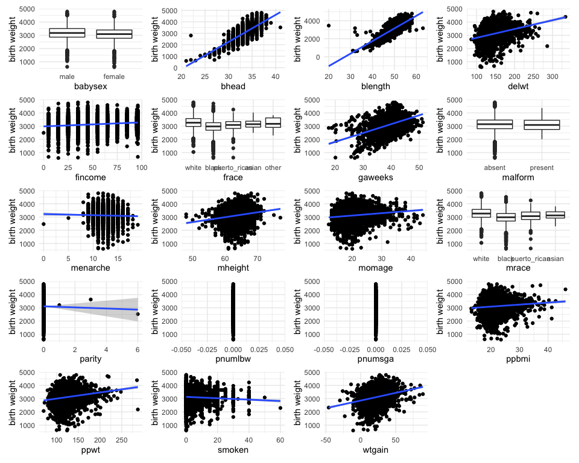

P8105 HW6
================
Shihui Zhu sz3029

## Problem 1

### Import data

Load and clean the data for regression analysis

``` r
birthweight_df <- 
  read_csv("data/birthweight.csv") %>%
  drop_na() %>%
  mutate(
    # change the numbers to text for a better readability
    babysex = ifelse(babysex == 1, 'male', 'female'),
    # convert to factor
    babysex = fct_infreq(babysex),
    # change the numbers to text for a better readability
    frace = case_when(
      frace == 1 ~ 'white',
      frace == 2 ~ 'black',
      frace == 3 ~ 'asian',
      frace == 4 ~ 'puerto_rican',
      frace == 8 ~ 'other',
      frace == 9 ~ 'unknown'),
    # convert to factor
    frace = fct_infreq(frace),
    # change the numbers to text for a better readability
    malform = ifelse(malform == 1, 'present', 'absent'),
    # convert to factor
    malform = fct_infreq(malform),
    # change the numbers to text for a better readability
    mrace = case_when(
      mrace == 1 ~ 'white',
      mrace == 2 ~ 'black',
      mrace == 3 ~ 'asian',
      mrace == 4 ~ 'puerto_rican',
      mrace == 8 ~ 'other'),
    # convert to factor
    mrace = fct_infreq(mrace),
    
    )
```

### Build model

They are 19 variables in total. We want to select the most important
variables that affect baby’s birth weight.

1.  Compute the marginal pmf/pdf of all variables, and get the p-values

``` r
# pmf/pdf
compute_pmf <- function(x) {
  fit = lm(bwt ~ x, data = birthweight_df)
  p_value = summary(fit)$coefficients[,4][2]
  return(p_value)
}

p_values = birthweight_df %>%
  select(-bwt) %>%
  map_dbl(compute_pmf)

p_values = bind_rows(p_values)

p_values %>% pivot_longer(
  everything(),
  values_to = 'p_value',
  names_to = 'variables') %>%
  mutate(
    significant = ifelse(p_value > 0.025 | is.na(p_value), 'No', 'Yes')
  ) %>%
  knitr::kable(digits = 3)
```

| variables | p_value | significant |
|:----------|--------:|:------------|
| babysex   |   0.000 | Yes         |
| bhead     |   0.000 | Yes         |
| blength   |   0.000 | Yes         |
| delwt     |   0.000 | Yes         |
| fincome   |   0.000 | Yes         |
| frace     |   0.000 | Yes         |
| gaweeks   |   0.000 | Yes         |
| malform   |   0.930 | No          |
| menarche  |   0.108 | No          |
| mheight   |   0.000 | Yes         |
| momage    |   0.000 | Yes         |
| mrace     |   0.000 | Yes         |
| parity    |   0.581 | No          |
| pnumlbw   |      NA | No          |
| pnumsga   |      NA | No          |
| ppbmi     |   0.000 | Yes         |
| ppwt      |   0.000 | Yes         |
| smoken    |   0.000 | Yes         |
| wtgain    |   0.000 | Yes         |

``` r
# graph
i = 1
compute_plist <- function(x) {
  if (is.factor(x)) {
    pl = birthweight_df %>% 
    ggplot(aes(x = x, y = bwt)) +
    geom_boxplot() +
    labs(
      x = '',
      y = "birth weight",
    )
  } else {
    pl = birthweight_df %>% 
    ggplot(aes(x = x, y = bwt)) +
    geom_point() +
    geom_smooth(method = "lm") +
    labs(
      x = '',
      y = "birth weight",
    )
  }
  i = i + 1
  return(pl)
}

plist = birthweight_df %>%
  select(-bwt) %>%
  map(compute_plist)

labels = birthweight_df %>%
  select(-bwt) %>%
  names()

for (i in 1:length(plist)) {
  plist[[i]] = plist[[i]] + labs(x = labels[[i]])
}

wrap_plots(plist, ncol = 4)
```



p-value

graph

ppwt and delwt seems to be redundant with wtgain, delete delwt

2.  Select the variables and build the MLR model

``` r
model_1 = lm(bwt ~ babysex + bhead + blength + frace + gaweeks + 
               mheight + momage + mrace +
               ppwt + smoken + wtgain, data = birthweight_df)

model_1 %>%
  broom::tidy() %>% 
  select(term, estimate, p.value) %>% 
  mutate(term = str_replace(term, "^babysex", "Baby sex: "),
         term = str_replace(term, "^frace", "Father race: "),
         term = str_replace(term, "^mrace", "Mother race: ")) %>% 
  knitr::kable(digits = 3)
```

| term                      |  estimate | p.value |
|:--------------------------|----------:|--------:|
| (Intercept)               | -6102.952 |   0.000 |
| Baby sex: female          |    29.196 |   0.001 |
| bhead                     |   131.075 |   0.000 |
| blength                   |    74.819 |   0.000 |
| Father race: black        |     9.843 |   0.831 |
| Father race: puerto_rican |   -51.518 |   0.249 |
| Father race: asian        |    16.450 |   0.812 |
| Father race: other        |    -1.266 |   0.986 |
| gaweeks                   |    11.315 |   0.000 |
| mheight                   |     6.711 |   0.000 |
| momage                    |     1.097 |   0.349 |
| Mother race: black        |  -152.459 |   0.001 |
| Mother race: puerto_rican |   -58.138 |   0.198 |
| Mother race: asian        |   -96.024 |   0.182 |
| ppwt                      |     1.410 |   0.000 |
| smoken                    |    -4.901 |   0.000 |
| wtgain                    |     4.143 |   0.000 |

### Diagnostics

``` r
modelr::add_residuals(birthweight_df, model_1) %>% head(10) %>% knitr::kable(digits = 3)
```

| babysex | bhead | blength |  bwt | delwt | fincome | frace | gaweeks | malform | menarche | mheight | momage | mrace | parity | pnumlbw | pnumsga |  ppbmi | ppwt | smoken | wtgain |    resid |
|:--------|------:|--------:|-----:|------:|--------:|:------|--------:|:--------|---------:|--------:|-------:|:------|-------:|--------:|--------:|-------:|-----:|-------:|-------:|---------:|
| female  |    34 |      51 | 3629 |   177 |      35 | white |    39.9 | absent  |       13 |      63 |     36 | white |      3 |       0 |       0 | 26.272 |  148 |      0 |     29 |  187.875 |
| male    |    34 |      48 | 3062 |   156 |      65 | black |    25.9 | absent  |       14 |      65 |     25 | black |      0 |       0 |       0 | 21.345 |  128 |      0 |     28 |  206.532 |
| female  |    36 |      50 | 3345 |   148 |      85 | white |    39.9 | absent  |       12 |      64 |     29 | white |      0 |       0 |       0 | 23.565 |  137 |      1 |     11 | -187.503 |
| male    |    34 |      52 | 3062 |   157 |      55 | white |    40.0 | absent  |       14 |      64 |     18 | white |      0 |       0 |       0 | 21.845 |  127 |     10 |     30 | -338.373 |
| female  |    34 |      52 | 3374 |   156 |       5 | white |    41.6 | absent  |       13 |      66 |     20 | white |      0 |       0 |       0 | 21.026 |  130 |      1 |     26 | -121.057 |
| male    |    33 |      52 | 3374 |   129 |      55 | white |    40.7 | absent  |       12 |      66 |     23 | white |      0 |       0 |       0 | 18.600 |  115 |      0 |     14 |  112.071 |
| female  |    33 |      46 | 2523 |   126 |      96 | black |    40.3 | absent  |       14 |      72 |     29 | black |      0 |       0 |       0 | 14.270 |  105 |      0 |     21 | -233.824 |
| female  |    33 |      49 | 2778 |   140 |       5 | white |    37.4 | absent  |       12 |      62 |     19 | white |      0 |       0 |       0 | 21.811 |  119 |      0 |     21 | -254.738 |
| male    |    36 |      52 | 3515 |   146 |      85 | white |    40.3 | absent  |       11 |      61 |     13 | white |      0 |       0 |       0 | 19.881 |  105 |      0 |     41 | -188.871 |
| male    |    33 |      50 | 3459 |   169 |      75 | black |    40.7 | absent  |       12 |      64 |     19 | black |      0 |       0 |       0 | 24.941 |  145 |      4 |     24 |  443.014 |

``` r
modelr::add_predictions(birthweight_df, model_1) %>% head(10) %>% knitr::kable(digits = 3)
```

| babysex | bhead | blength |  bwt | delwt | fincome | frace | gaweeks | malform | menarche | mheight | momage | mrace | parity | pnumlbw | pnumsga |  ppbmi | ppwt | smoken | wtgain |     pred |
|:--------|------:|--------:|-----:|------:|--------:|:------|--------:|:--------|---------:|--------:|-------:|:------|-------:|--------:|--------:|-------:|-----:|-------:|-------:|---------:|
| female  |    34 |      51 | 3629 |   177 |      35 | white |    39.9 | absent  |       13 |      63 |     36 | white |      3 |       0 |       0 | 26.272 |  148 |      0 |     29 | 3441.125 |
| male    |    34 |      48 | 3062 |   156 |      65 | black |    25.9 | absent  |       14 |      65 |     25 | black |      0 |       0 |       0 | 21.345 |  128 |      0 |     28 | 2855.468 |
| female  |    36 |      50 | 3345 |   148 |      85 | white |    39.9 | absent  |       12 |      64 |     29 | white |      0 |       0 |       0 | 23.565 |  137 |      1 |     11 | 3532.503 |
| male    |    34 |      52 | 3062 |   157 |      55 | white |    40.0 | absent  |       14 |      64 |     18 | white |      0 |       0 |       0 | 21.845 |  127 |     10 |     30 | 3400.373 |
| female  |    34 |      52 | 3374 |   156 |       5 | white |    41.6 | absent  |       13 |      66 |     20 | white |      0 |       0 |       0 | 21.026 |  130 |      1 |     26 | 3495.057 |
| male    |    33 |      52 | 3374 |   129 |      55 | white |    40.7 | absent  |       12 |      66 |     23 | white |      0 |       0 |       0 | 18.600 |  115 |      0 |     14 | 3261.929 |
| female  |    33 |      46 | 2523 |   126 |      96 | black |    40.3 | absent  |       14 |      72 |     29 | black |      0 |       0 |       0 | 14.270 |  105 |      0 |     21 | 2756.824 |
| female  |    33 |      49 | 2778 |   140 |       5 | white |    37.4 | absent  |       12 |      62 |     19 | white |      0 |       0 |       0 | 21.811 |  119 |      0 |     21 | 3032.738 |
| male    |    36 |      52 | 3515 |   146 |      85 | white |    40.3 | absent  |       11 |      61 |     13 | white |      0 |       0 |       0 | 19.881 |  105 |      0 |     41 | 3703.871 |
| male    |    33 |      50 | 3459 |   169 |      75 | black |    40.7 | absent  |       12 |      64 |     19 | black |      0 |       0 |       0 | 24.941 |  145 |      4 |     24 | 3015.986 |

Show an example model residuals against fitted values

``` r
birthweight_df %>% 
  modelr::add_residuals(model_1) %>% 
  ggplot(aes(x = mrace, y = resid)) + 
  geom_violin() +
  labs(
    title = "Violin Residuals Plots By Category of Mother's Race",
    x = 'Mother\'s race',
    y = 'Baby\'s Weight'
  )
```


